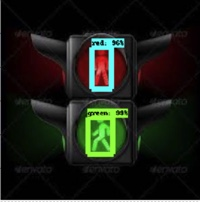
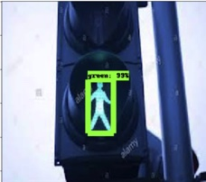
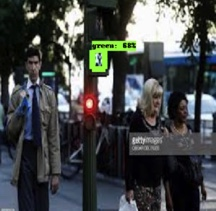
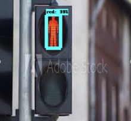

# Traffic Light Detection

A neural network that performs object detection on images containing pedestrian traffic lights to help visually impaired pedestrians navigate safely outdoors.

The neural network was trained using [TensorFlow's](https://tensorflow.org) Object Detection Library.

The file [detection-inference-test.ipynb](utils/detection-inference-test.ipynb) can be used to run object detection inference (recommended to run using Google Colab).

The file [Copy_of_tensorflow_object_detection_training_colab.ipynb](utils/Copy_of_tensorflow_object_detection_training_colab.ipynb) was used to train the neural network (Also recommended to run using Google Colab).

The [Utils](utils) folder contains python files used to load and process the training and validation images used.

The [Models](models) folder contains saved TensorFlow model files.

## Libraries and Software Used

The Python library was used for the majority of the neural network training.

Python libraries used include [TensorFlow](https://tensorflow.org), The [XML Element Tree Library](https://docs.python.org/2/library/xml.etree.elementtree.html), and The [OpenCV](https://opencv.org/) library 

Images used for training and validation were obtained from google images.

The [LabelImg](https://pypi.org/project/labelImg/) software for annotating and labeling images

## Sample Output

The neural network's output appears similarly to the following images:

 

 

